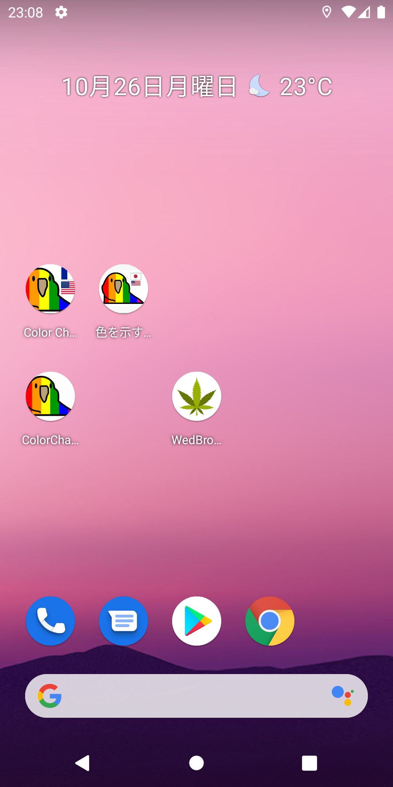
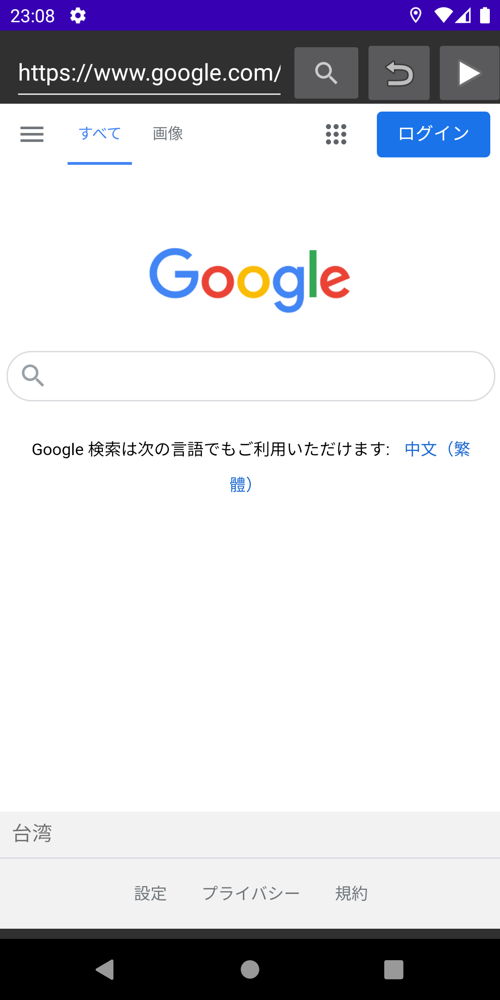
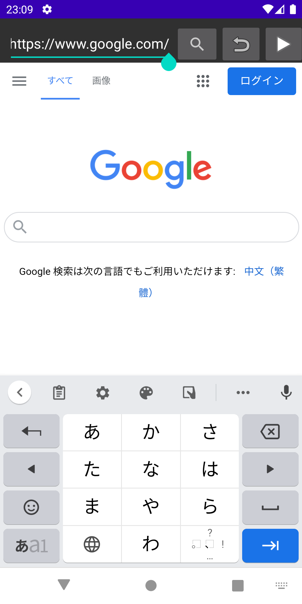
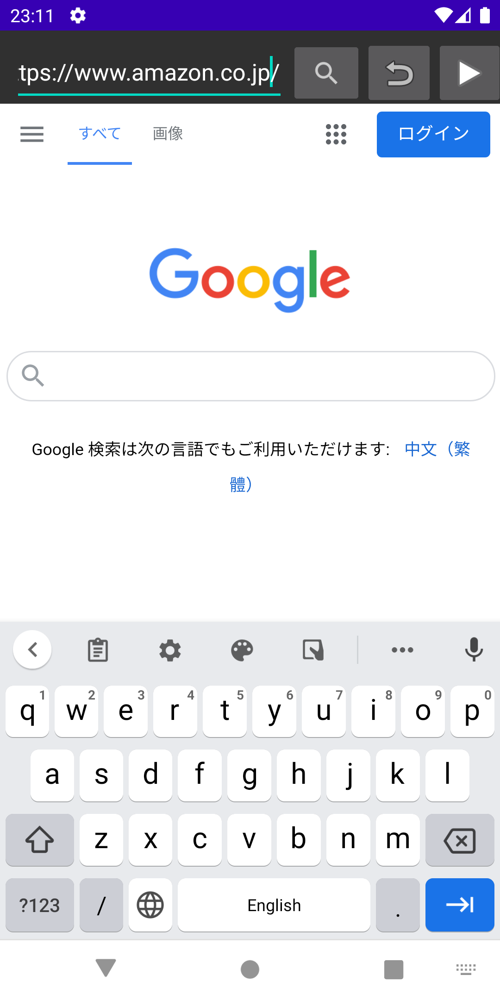
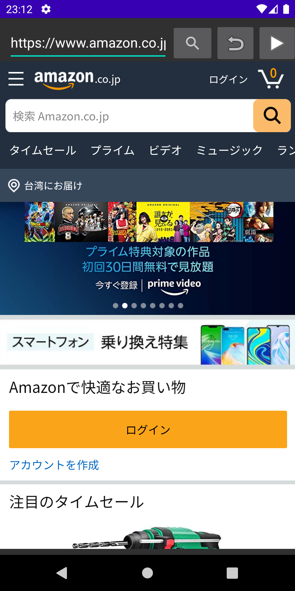
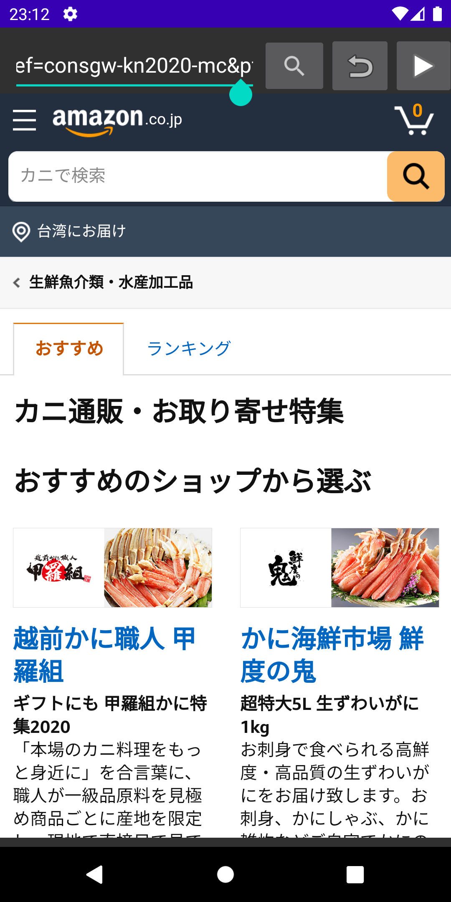



# Assignment07 WebBrowserApp

Instructions: Over the next series of labs we will create a Web Browser app, enabling a user to enter a URL, and displaying the specified website in a WebView. Your application will be built using fragments, with each fragment having a specific function.

# Application Function

Find the app called "WedBrowserApp" and tap on it.

The app will load google once user entered the app

User can input the url of the web page they want to go

In this step, PLEASE USE THE KEYBOARD ON THE SCREEN INSTEAD OF COMPUTER KEYBOARD. Or the page will refresh by itself.

press magnifier button and the webview will go to web page that user input.

User can use back and forward button to view the web page.

